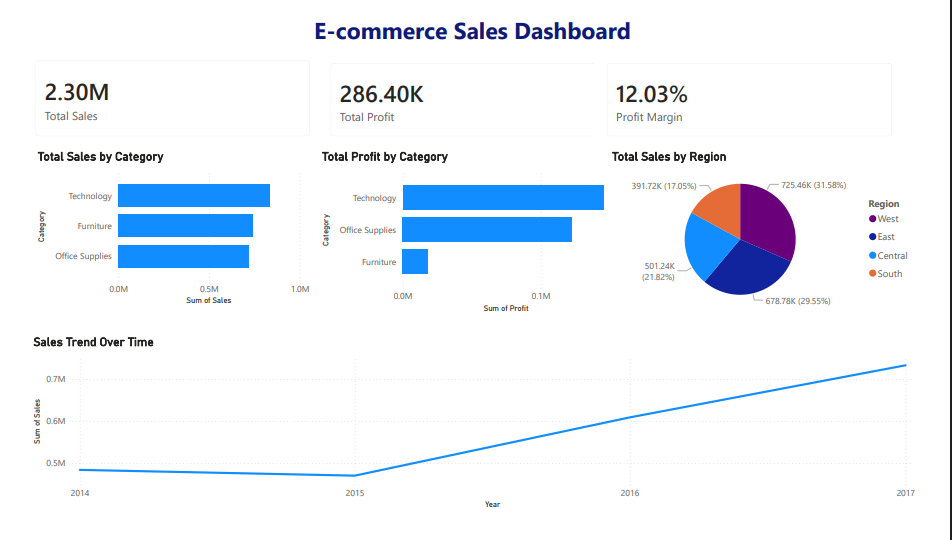

# E-commerce Sales Analysis

## 📌 Project Overview

This project analyzes e-commerce sales data to generate actionable business insights using SQL, Python, and Power BI.

## 🛠 Tools Used

* Power BI (Dashboard & Visualization)
* Python (Pandas for Data Analysis)
* SQL (Data Querying)
* Excel (Data Source)

## 🔄 Workflow

1. Data Collection (Excel dataset)
2. Data Cleaning using Python
3. Data Analysis using SQL queries
4. Data Visualization using Power BI
5. Business Insights Generation

## 📊 Dashboard Preview

## 📈 Key Insights

* Technology category has the highest sales
* West region contributes the most revenue
* Sales show steady growth after 2015
* Profit margin is around 12%

## 📁 Project Structure

* data/ → Dataset
* sql/ → SQL queries
* python/ → Data analysis
* powerbi/ → Dashboard
* images/ → Screenshots
* insights.md → Detailed insights

## 🚀 Outcome

This project demonstrates an end-to-end data analytics workflow from raw data to meaningful business insights.
